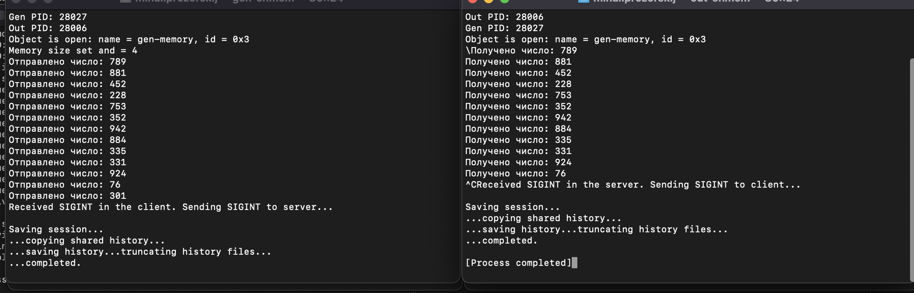
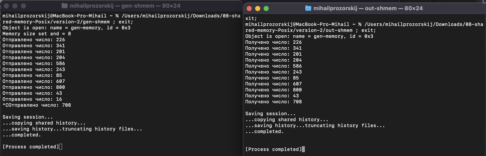

# OS_HW7
# Прозорский Михаил Алексеевич
# БПИ224

## Условие
### До 8 баллов
Разработать программы клиента и сервера, взаимодействующих через разделяемую память с использованием функций POSIX Клиент генерирует случайные числа в том же диапазоне, что и ранее рассмотренный на семинаре пример. Сервер осуществляет их вывод. Предполагается (но специально не контролируется), что запускаются только один клиент и один сервер. Необходимо обеспечить корректное завершение работы для одного клиента и одного сервера, при котором удаляется сегмент разделяемой памяти. Предложить и реализовать свой вариант корректного завершения. Описать этот вариант в отчете.

### Опционально до +2 баллов
Реализовать и описать в отчете дополнительно один или два варианта общего завершения клиента и сервера (+1 балл за каждый вариант).

## Решение
Было выполнено на оценку 9 (один дополнительный вариант)
### version-1
Завершение основано на передаче сигнала об завершении. Чтобы это осушествить мы вводим и сохраняем PID процессов, а потом по ним передаем нужный сигнал. Завершение осуществляется по комбинации клавиш Ctrl+C.
### version-2
Завершение основано на флаге, которому устанавливается значение 1, когда требуется завершить процессы. При завершении у структуры устанавливается значение флага равное 1 и после передачи, если флаг равен 1, то процессы завершаются. Завершение осуществляется по комбинации клавиш Ctrl+C.

#### Примечание
Сначала надо запускать gen файл, в противном случае out файл не найдет передающий процесс и завершится.
Если скомпилированные файлы не запускаются, то их следует удалить и перекомпилировать следующими командами(к примеру используя gcc):

##### gcc receiver.c -o receiver
##### gcc transmitter.c -o transmitter

## Тесты
### version-1

### version-2

